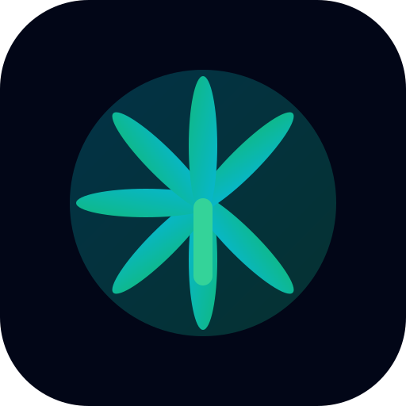

<div align="center">



# Stash Sage

### Track your stash. Log your sessions. Connect with your community.

A free, privacy-first stash tracker that works offline. No account required to start.

[](https://thestashsage.vercel.app)
[](https://thestashsage.vercel.app)


</div>

---

## ✨ What is Stash Sage?

Stash Sage is a **free, open-source** stash tracker and community platform. Think of it as your personal inventory manager — built specifically for tracking what you have, what you've used, and what it's all worth.

🎒 **No download needed** — it runs right in your browser
📱 **Works offline** — use it anywhere, anytime
🔒 **Your data stays private** — stored on your device by default
☁️ **Sync when you want** — create an account to back up and sync across devices

---

## 🚀 Features

### 📦 Stash Tracking
Add your strains with full details — name, brand, type, THC/CBD %, price, photos, rating, and notes. Organize with **color-coded labels**, filters, and search. Switch between **grid**, **list**, and **compact** views.

### 🔥 Consumption Logging
Log what you use with one-tap quick amounts or custom values. Totals update automatically. Full filterable history with notes.

### ⏱️ Session Mode
Start a session with a **circular hit timer**, track hits per person with **rotation switching**, and calculate bowls per person automatically. Perfect for group sessions.

### 📊 Dashboard
Beautiful animated stat tiles and charts showing your usage patterns, spending, strain distribution, and consumption trends over time.

### 👥 Community Feed
Share posts, follow friends, like and comment. Browse **Latest**, **Following**, **Trending**, or **Bookmarked** feeds. Real-time updates.

### 🏪 Marketplace
Browse and list products for sale. Filter, sort, and contact sellers through Discord, Telegram, Signal, WhatsApp, and more.

### 💎 Everything Else
| Feature | Description |
|---|---|
| 💾 **Export** | JSON, CSV, PDF, or clipboard backups |
| 🔒 **PIN Lock** | 4–6 digit lock to keep your stash private |
| 🌍 **Multi-Language** | English, Spanish, French, German, Portuguese |
| 🎨 **Themes** | Dark & light modes with animated transitions |
| 📱 **PWA** | Install to your home screen — feels native |

---

## 🆓 Free vs Account

| Feature | 🆓 No Account | ✅ With Account |
|---|:---:|:---:|
| Full stash tracking | ✅ | ✅ |
| Works offline | ✅ | ✅ |
| Dashboard & charts | ✅ | ✅ |
| Cloud backup & sync | — | ✅ |
| Post in community | — | ✅ |
| List in marketplace | — | ✅ |

---

## 🛠️ Built With

| Layer | Tech |
|---|---|
| ⚛️ Framework | React 18 + TypeScript |
| ⚡ Build | Vite 6 |
| 🎨 Styling | Tailwind CSS 3 + Mantine UI 7 |
| ✨ Animations | Framer Motion + Magic UI |
| ☁️ Backend | Supabase (Postgres, Auth, Realtime) |
| 📊 Charts | Recharts |
| 📱 Offline | Workbox PWA |

---

## 🔧 Run It Locally

```bash
# Clone the repo
git clone https://github.com/Robonator9000/Stash-Sage.git
cd Stash-Sage

# Install dependencies
npm install

# Start developing → http://localhost:5173
npm run dev

# Build for production
npm run build
```

> 💡 **No Supabase needed to start!** All local features work out of the box. To enable cloud sync and community, copy `.env.example` to `.env` and add your credentials.

---

## 📂 Project Structure

```
src/
├── 📁 components/     UI components (modals, feeds, cards, magicui)
├── 📁 contexts/       React contexts (Auth, Settings)
├── 📁 hooks/          Custom hooks (modal animations)
├── 📁 types/          TypeScript definitions
├── 📁 utils/          Helpers (supabase, storage, formatting)
└── 📄 App.tsx         Main app entry point
```

---

## 🤝 Contributing

Contributions are welcome! Whether it's a bug fix, feature idea, or translation improvement:

1. Fork the repo
2. Create a feature branch (`git checkout -b feature/amazing-thing`)
3. Commit your changes (`git commit -m 'Add amazing thing'`)
4. Push and open a Pull Request

---

## 📊 Activity

<div align="center">


</div>

---

## 📄 License

This project is licensed under the **MIT License** — free to use, modify, and distribute.

---

<div align="center">

**🌿 [Try Stash Sage](https://thestashsage.vercel.app)**

⭐ Star this repo if you find it helpful!

Made with 💚 for the community

</div>
